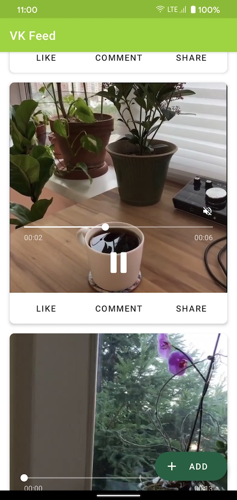
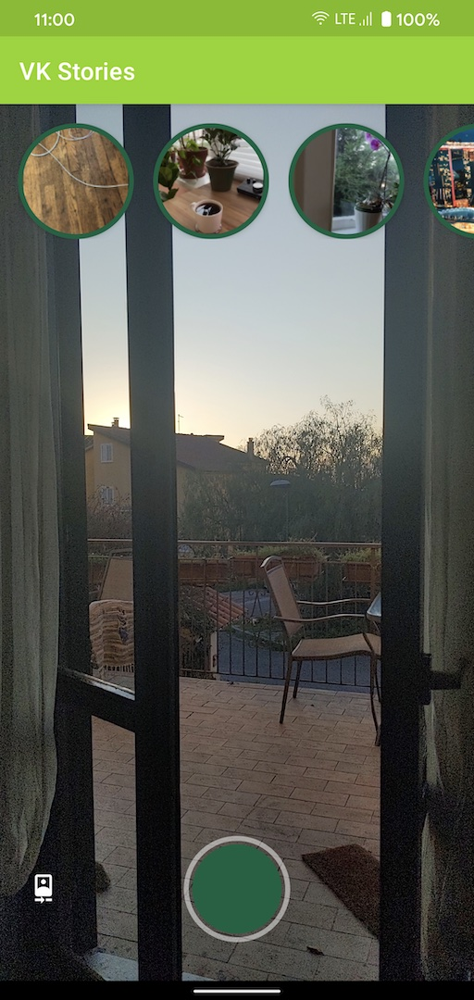

# VideoKit Samples

This repository contains a set of sample applications to help you learn about VideoKit SDKs
in Android. Each sample demonstrates different use cases and APIs.

For more information, please [read the documentation](https://docs.video.io/docs/android/intro-about)!

🧬 Samples
------------

| Project | |
|:-----|---------|
|  <br></img> VK Feed <br><br> A sample app that displays a reactive vertical feed of videos, with the ability to add new posts. It demonstrates: <br><br> • Using playlists for preloading<br>• Using PlayerView<br>• Player controls<br>• Recording flow and controls<br><br> **[> Browse](feed/)**<br><br> |  |
|  |  |
|  <br></img> VK Stories <br><br>A sample app that shows a recording interface to add new stories, and a reactive list of available stories. It demonstrates: <br><br>• Using reactive playlists<br>• Using Pager to display playlists<br>• Custom recorder controls<br>• Recorder state handling<br><br>**[> Browse](stories/)** <br><br> | |

## License

```
Copyright 2020 Video, Inc.

Licensed under the Apache License, Version 2.0 (the "License");
you may not use this file except in compliance with the License.
You may obtain a copy of the License at

    https://www.apache.org/licenses/LICENSE-2.0

Unless required by applicable law or agreed to in writing, software
distributed under the License is distributed on an "AS IS" BASIS,
WITHOUT WARRANTIES OR CONDITIONS OF ANY KIND, either express or implied.
See the License for the specific language governing permissions and
limitations under the License.
```